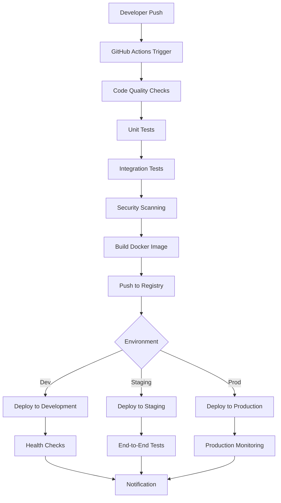

# 🚀 Lesson 18: CI/CD Pipeline Setup - Concept Guide

## 🎯 Learning Objectives

By the end of this lesson, you will:
- **Design CI/CD pipelines** with GitHub Actions for automated testing, building, and deployment
- **Implement automated testing** strategies including unit, integration, and end-to-end tests
- **Configure code quality checks** with linting, security scanning, and dependency analysis
- **Manage build artifacts** with versioning, tagging, and registry integration
- **Create deployment automation** with environment promotion and rollback capabilities
- **Monitor pipeline performance** with metrics, notifications, and failure analysis

---

## 🔍 Why CI/CD Matters

### **The DevOps Revolution**
```yaml
# Before CI/CD: Manual, Error-Prone Process
Developer → Manual Build → Manual Test → Manual Deploy → Hope It Works
- 2 weeks for simple changes
- 50% deployment failures
- Manual rollbacks taking hours
- Inconsistent environments

# After CI/CD: Automated, Reliable Pipeline
Commit → Auto Test → Auto Build → Auto Deploy → Monitor
- Minutes for deployment
- <5% deployment failures  
- Automatic rollbacks in seconds
- Consistent, reproducible deployments
```

### **Business Benefits**
- **Faster Time-to-Market**: Deploy features in minutes instead of weeks
- **Higher Quality**: Automated testing catches issues before production
- **Reduced Risk**: Small, frequent deployments with easy rollbacks
- **Developer Productivity**: Focus on features, not deployment mechanics
- **Compliance**: Audit trails and automated security scanning

---

## 🏗️ CI/CD Pipeline Architecture

### **Complete Pipeline Overview**


### **GitHub Actions Workflow Structure**
```yaml
name: Complete CI/CD Pipeline

on:
  push:
    branches: [main, develop]
  pull_request:
    branches: [main]
  release:
    types: [published]

env:
  REGISTRY: ghcr.io
  IMAGE_NAME: ${{ github.repository }}

jobs:
  # Stage 1: Code Quality and Testing
  code-quality:
    runs-on: ubuntu-latest
    steps:
      - name: Checkout code
        uses: actions/checkout@v4
      
      - name: Setup JDK 17
        uses: actions/setup-java@v3
        with:
          java-version: '17'
          distribution: 'temurin'
      
      - name: Cache Gradle dependencies
        uses: actions/cache@v3
        with:
          path: |
            ~/.gradle/caches
            ~/.gradle/wrapper
          key: ${{ runner.os }}-gradle-${{ hashFiles('**/*.gradle*', '**/gradle-wrapper.properties') }}
      
      - name: Run code quality checks
        run: |
          ./gradlew check
          ./gradlew jacocoTestReport
      
      - name: Upload coverage reports
        uses: codecov/codecov-action@v3
        with:
          file: build/reports/jacoco/test/jacocoTestReport.xml

  # Stage 2: Security Scanning
  security:
    runs-on: ubuntu-latest
    needs: code-quality
    steps:
      - name: Checkout code
        uses: actions/checkout@v4
      
      - name: Run Trivy vulnerability scanner
        uses: aquasecurity/trivy-action@master
        with:
          scan-type: 'fs'
          scan-ref: '.'
          format: 'sarif'
          output: 'trivy-results.sarif'
      
      - name: Upload Trivy scan results
        uses: github/codeql-action/upload-sarif@v2
        with:
          sarif_file: 'trivy-results.sarif'

  # Stage 3: Build and Push
  build-and-push:
    runs-on: ubuntu-latest
    needs: [code-quality, security]
    outputs:
      image-tag: ${{ steps.meta.outputs.tags }}
      image-digest: ${{ steps.build.outputs.digest }}
    steps:
      - name: Checkout code
        uses: actions/checkout@v4
      
      - name: Log in to Container Registry
        uses: docker/login-action@v2
        with:
          registry: ${{ env.REGISTRY }}
          username: ${{ github.actor }}
          password: ${{ secrets.GITHUB_TOKEN }}
      
      - name: Extract metadata
        id: meta
        uses: docker/metadata-action@v4
        with:
          images: ${{ env.REGISTRY }}/${{ env.IMAGE_NAME }}
          tags: |
            type=ref,event=branch
            type=ref,event=pr
            type=semver,pattern={{version}}
            type=sha,prefix={{branch}}-
      
      - name: Build and push Docker image
        id: build
        uses: docker/build-push-action@v4
        with:
          context: .
          push: true
          tags: ${{ steps.meta.outputs.tags }}
          labels: ${{ steps.meta.outputs.labels }}
          cache-from: type=gha
          cache-to: type=gha,mode=max

  # Stage 4: Deploy to Development
  deploy-dev:
    runs-on: ubuntu-latest
    needs: build-and-push
    if: github.ref == 'refs/heads/develop'
    environment: development
    steps:
      - name: Deploy to Development
        run: |
          echo "Deploying ${{ needs.build-and-push.outputs.image-tag }} to development"
          # Deployment logic here

  # Stage 5: Deploy to Staging
  deploy-staging:
    runs-on: ubuntu-latest
    needs: build-and-push
    if: github.ref == 'refs/heads/main'
    environment: staging
    steps:
      - name: Deploy to Staging
        run: |
          echo "Deploying ${{ needs.build-and-push.outputs.image-tag }} to staging"
          # Deployment logic here
      
      - name: Run E2E Tests
        run: |
          # End-to-end testing against staging
          echo "Running E2E tests"

  # Stage 6: Deploy to Production
  deploy-production:
    runs-on: ubuntu-latest
    needs: [build-and-push, deploy-staging]
    if: github.event_name == 'release'
    environment: production
    steps:
      - name: Deploy to Production
        run: |
          echo "Deploying ${{ needs.build-and-push.outputs.image-tag }} to production"
          # Blue-green deployment logic
      
      - name: Health Check
        run: |
          # Production health verification
          echo "Verifying production deployment"
```

---

## 🧪 Automated Testing Strategies

### **Testing Pyramid Implementation**
```yaml
# Comprehensive Testing Pipeline
name: Testing Pipeline

jobs:
  unit-tests:
    runs-on: ubuntu-latest
    steps:
      - uses: actions/checkout@v4
      - uses: actions/setup-java@v3
        with:
          java-version: '17'
          distribution: 'temurin'
      
      - name: Run Unit Tests
        run: ./gradlew test
      
      - name: Generate Test Report
        run: ./gradlew jacocoTestReport
      
      - name: Upload Coverage
        uses: codecov/codecov-action@v3
        with:
          file: build/reports/jacoco/test/jacocoTestReport.xml
          fail_ci_if_error: true
          verbose: true

  integration-tests:
    runs-on: ubuntu-latest
    needs: unit-tests
    services:
      postgres:
        image: postgres:15
        env:
          POSTGRES_PASSWORD: testpass
          POSTGRES_DB: testdb
        options: >-
          --health-cmd pg_isready
          --health-interval 10s
          --health-timeout 5s
          --health-retries 5
      
      redis:
        image: redis:7
        options: >-
          --health-cmd "redis-cli ping"
          --health-interval 10s
          --health-timeout 5s
          --health-retries 5
    
    steps:
      - uses: actions/checkout@v4
      - uses: actions/setup-java@v3
        with:
          java-version: '17'
          distribution: 'temurin'
      
      - name: Run Integration Tests
        run: ./gradlew integrationTest
        env:
          SPRING_DATASOURCE_URL: jdbc:postgresql://postgres:5432/testdb
          SPRING_DATASOURCE_USERNAME: postgres
          SPRING_DATASOURCE_PASSWORD: testpass
          SPRING_DATA_REDIS_HOST: redis
          SPRING_DATA_REDIS_PORT: 6379

  contract-tests:
    runs-on: ubuntu-latest
    needs: integration-tests
    steps:
      - uses: actions/checkout@v4
      - uses: actions/setup-java@v3
        with:
          java-version: '17'
          distribution: 'temurin'
      
      - name: Run Contract Tests
        run: ./gradlew contractTest
      
      - name: Publish Contracts
        run: ./gradlew publishContracts
        env:
          PACT_BROKER_URL: ${{ secrets.PACT_BROKER_URL }}
          PACT_BROKER_TOKEN: ${{ secrets.PACT_BROKER_TOKEN }}

  e2e-tests:
    runs-on: ubuntu-latest
    needs: contract-tests
    steps:
      - uses: actions/checkout@v4
      
      - name: Start Application Stack
        run: docker-compose -f docker-compose.test.yml up -d
      
      - name: Wait for Application
        run: |
          timeout 60 sh -c 'until curl -f http://localhost:8080/actuator/health; do sleep 5; done'
      
      - name: Run E2E Tests
        run: |
          npm install -g newman
          newman run tests/e2e/postman-collection.json \
            --environment tests/e2e/environment.json \
            --reporters cli,junit \
            --reporter-junit-export results/e2e-results.xml
      
      - name: Upload E2E Results
        uses: actions/upload-artifact@v3
        if: always()
        with:
          name: e2e-test-results
          path: results/e2e-results.xml

  performance-tests:
    runs-on: ubuntu-latest
    needs: e2e-tests
    if: github.event_name == 'release'
    steps:
      - uses: actions/checkout@v4
      
      - name: Setup K6
        run: |
          sudo apt-key adv --keyserver hkp://keyserver.ubuntu.com:80 --recv-keys C5AD17C747E3415A3642D57D77C6C491D6AC1D69
          echo "deb https://dl.k6.io/deb stable main" | sudo tee /etc/apt/sources.list.d/k6.list
          sudo apt-get update
          sudo apt-get install k6
      
      - name: Run Performance Tests
        run: |
          k6 run tests/performance/load-test.js \
            --out json=results/performance-results.json
      
      - name: Upload Performance Results
        uses: actions/upload-artifact@v3
        with:
          name: performance-test-results
          path: results/performance-results.json
```

### **Test Configuration Files**
```javascript
// tests/performance/load-test.js
import http from 'k6/http';
import { check, sleep } from 'k6';
import { Rate } from 'k6/metrics';

export let errorRate = new Rate('errors');

export let options = {
  stages: [
    { duration: '2m', target: 10 }, // Ramp up
    { duration: '5m', target: 10 }, // Stay at 10 users
    { duration: '2m', target: 20 }, // Ramp up to 20 users
    { duration: '5m', target: 20 }, // Stay at 20 users
    { duration: '2m', target: 0 },  // Ramp down
  ],
  thresholds: {
    http_req_duration: ['p(95)<500'], // 95% of requests under 500ms
    http_req_failed: ['rate<0.02'],   // Error rate under 2%
  },
};

export default function() {
  // Test user registration
  let registerResponse = http.post('http://localhost:8080/api/users/register', 
    JSON.stringify({
      email: `user${__VU}${__ITER}@example.com`,
      password: 'testpassword123'
    }), {
      headers: { 'Content-Type': 'application/json' },
    }
  );
  
  check(registerResponse, {
    'registration status is 200': (r) => r.status === 200,
    'registration response time < 500ms': (r) => r.timings.duration < 500,
  }) || errorRate.add(1);
  
  sleep(1);
  
  // Test user login
  let loginResponse = http.post('http://localhost:8080/api/users/login',
    JSON.stringify({
      email: `user${__VU}${__ITER}@example.com`,
      password: 'testpassword123'
    }), {
      headers: { 'Content-Type': 'application/json' },
    }
  );
  
  check(loginResponse, {
    'login status is 200': (r) => r.status === 200,
    'login response time < 300ms': (r) => r.timings.duration < 300,
  }) || errorRate.add(1);
  
  sleep(1);
}
```

---

## 🔒 Security and Quality Gates

### **Comprehensive Security Pipeline**
```yaml
name: Security Scanning

jobs:
  dependency-check:
    runs-on: ubuntu-latest
    steps:
      - uses: actions/checkout@v4
      
      - name: Run OWASP Dependency Check
        uses: dependency-check/Dependency-Check_Action@main
        with:
          project: 'kotlin-kickstarter'
          path: '.'
          format: 'ALL'
          
      - name: Upload Results
        uses: actions/upload-artifact@v3
        with:
          name: dependency-check-report
          path: reports/

  sast-scan:
    runs-on: ubuntu-latest
    steps:
      - uses: actions/checkout@v4
      
      - name: Initialize CodeQL
        uses: github/codeql-action/init@v2
        with:
          languages: java
      
      - name: Build Project
        run: ./gradlew build -x test
      
      - name: Perform CodeQL Analysis
        uses: github/codeql-action/analyze@v2

  secret-scan:
    runs-on: ubuntu-latest
    steps:
      - uses: actions/checkout@v4
        with:
          fetch-depth: 0
      
      - name: Run TruffleHog
        uses: trufflesecurity/trufflehog@main
        with:
          path: ./
          base: main
          head: HEAD

  container-scan:
    runs-on: ubuntu-latest
    needs: build-and-push
    steps:
      - name: Run Trivy vulnerability scanner
        uses: aquasecurity/trivy-action@master
        with:
          image-ref: ${{ needs.build-and-push.outputs.image-tag }}
          format: 'table'
          exit-code: '1'
          ignore-unfixed: true
          vuln-type: 'os,library'
          severity: 'CRITICAL,HIGH'

  license-check:
    runs-on: ubuntu-latest
    steps:
      - uses: actions/checkout@v4
      
      - name: Check Licenses
        run: |
          ./gradlew checkLicense
          ./gradlew generateLicenseReport
      
      - name: Upload License Report
        uses: actions/upload-artifact@v3
        with:
          name: license-report
          path: build/reports/license/
```

### **Code Quality Gates**
```yaml
name: Code Quality

jobs:
  code-analysis:
    runs-on: ubuntu-latest
    steps:
      - uses: actions/checkout@v4
      
      - name: Setup SonarCloud
        uses: SonarSource/sonarcloud-github-action@master
        env:
          GITHUB_TOKEN: ${{ secrets.GITHUB_TOKEN }}
          SONAR_TOKEN: ${{ secrets.SONAR_TOKEN }}
      
      - name: Run Detekt
        run: ./gradlew detekt
      
      - name: Upload Detekt Results
        uses: actions/upload-artifact@v3
        with:
          name: detekt-reports
          path: build/reports/detekt/

  code-coverage:
    runs-on: ubuntu-latest
    steps:
      - uses: actions/checkout@v4
      
      - name: Generate Coverage Report
        run: |
          ./gradlew test jacocoTestReport
      
      - name: Check Coverage Threshold
        run: |
          ./gradlew jacocoTestCoverageVerification
      
      - name: Comment Coverage on PR
        if: github.event_name == 'pull_request'
        uses: madrapps/jacoco-report@v1.3
        with:
          paths: build/reports/jacoco/test/jacocoTestReport.xml
          token: ${{ secrets.GITHUB_TOKEN }}
          min-coverage-overall: 80
          min-coverage-changed-files: 90
```

---

## 📦 Artifact Management & Versioning

### **Semantic Versioning Strategy**
```yaml
name: Release Management

on:
  push:
    branches: [main]
    tags: ['v*']

jobs:
  semantic-release:
    runs-on: ubuntu-latest
    steps:
      - uses: actions/checkout@v4
        with:
          fetch-depth: 0
          token: ${{ secrets.RELEASE_TOKEN }}
      
      - name: Setup Node.js
        uses: actions/setup-node@v3
        with:
          node-version: '18'
      
      - name: Install semantic-release
        run: |
          npm install -g semantic-release \
            @semantic-release/git \
            @semantic-release/github \
            @semantic-release/changelog
      
      - name: Create Release
        run: semantic-release
        env:
          GITHUB_TOKEN: ${{ secrets.RELEASE_TOKEN }}

  build-artifacts:
    runs-on: ubuntu-latest
    needs: semantic-release
    steps:
      - uses: actions/checkout@v4
      
      - name: Setup JDK 17
        uses: actions/setup-java@v3
        with:
          java-version: '17'
          distribution: 'temurin'
      
      - name: Build Distribution
        run: |
          ./gradlew build -x test
          ./gradlew bootJar
          ./gradlew distTar distZip
      
      - name: Create Release Assets
        run: |
          mkdir -p release-assets
          cp build/libs/*.jar release-assets/
          cp build/distributions/*.tar release-assets/
          cp build/distributions/*.zip release-assets/
      
      - name: Upload Release Assets
        uses: actions/upload-artifact@v3
        with:
          name: release-artifacts
          path: release-assets/
          retention-days: 90

  publish-packages:
    runs-on: ubuntu-latest
    needs: build-artifacts
    if: startsWith(github.ref, 'refs/tags/v')
    steps:
      - uses: actions/checkout@v4
      
      - name: Setup JDK 17
        uses: actions/setup-java@v3
        with:
          java-version: '17'
          distribution: 'temurin'
      
      - name: Publish to Maven Central
        run: ./gradlew publishToSonatype closeAndReleaseStagingRepository
        env:
          SONATYPE_USERNAME: ${{ secrets.SONATYPE_USERNAME }}
          SONATYPE_PASSWORD: ${{ secrets.SONATYPE_PASSWORD }}
          SIGNING_KEY_ID: ${{ secrets.SIGNING_KEY_ID }}
          SIGNING_PASSWORD: ${{ secrets.SIGNING_PASSWORD }}
          SIGNING_SECRET_KEY_RING_FILE: ${{ secrets.SIGNING_SECRET_KEY_RING_FILE }}
```

### **Container Registry Management**
```yaml
name: Container Registry

jobs:
  multi-arch-build:
    runs-on: ubuntu-latest
    steps:
      - uses: actions/checkout@v4
      
      - name: Set up Docker Buildx
        uses: docker/setup-buildx-action@v2
      
      - name: Log in to Multiple Registries
        run: |
          echo ${{ secrets.GITHUB_TOKEN }} | docker login ghcr.io -u ${{ github.actor }} --password-stdin
          echo ${{ secrets.DOCKERHUB_TOKEN }} | docker login docker.io -u ${{ secrets.DOCKERHUB_USERNAME }} --password-stdin
          echo ${{ secrets.AWS_ECR_TOKEN }} | docker login ${{ secrets.AWS_ECR_REGISTRY }} -u AWS --password-stdin
      
      - name: Extract metadata
        id: meta
        uses: docker/metadata-action@v4
        with:
          images: |
            ghcr.io/${{ github.repository }}
            docker.io/${{ github.repository }}
            ${{ secrets.AWS_ECR_REGISTRY }}/${{ github.repository }}
          tags: |
            type=ref,event=branch
            type=ref,event=pr
            type=semver,pattern={{version}}
            type=semver,pattern={{major}}.{{minor}}
            type=semver,pattern={{major}}
            type=sha,prefix={{branch}}-
      
      - name: Build and push multi-architecture images
        uses: docker/build-push-action@v4
        with:
          context: .
          platforms: linux/amd64,linux/arm64
          push: true
          tags: ${{ steps.meta.outputs.tags }}
          labels: ${{ steps.meta.outputs.labels }}
          cache-from: type=gha
          cache-to: type=gha,mode=max

  sign-images:
    runs-on: ubuntu-latest
    needs: multi-arch-build
    if: github.event_name == 'release'
    steps:
      - name: Install Cosign
        uses: sigstore/cosign-installer@v3
      
      - name: Sign Container Images
        run: |
          cosign sign --key env://COSIGN_PRIVATE_KEY \
            ghcr.io/${{ github.repository }}:${{ github.ref_name }}
        env:
          COSIGN_PRIVATE_KEY: ${{ secrets.COSIGN_PRIVATE_KEY }}
          COSIGN_PASSWORD: ${{ secrets.COSIGN_PASSWORD }}
```

---

## 🚀 Deployment Automation Strategies

### **Blue-Green Deployment**
```yaml
name: Blue-Green Deployment

jobs:
  deploy-blue-green:
    runs-on: ubuntu-latest
    environment: production
    steps:
      - uses: actions/checkout@v4
      
      - name: Setup kubectl
        uses: azure/setup-kubectl@v3
        with:
          version: 'latest'
      
      - name: Configure kubectl
        run: |
          echo "${{ secrets.KUBECONFIG }}" | base64 -d > kubeconfig
          export KUBECONFIG=kubeconfig
      
      - name: Determine Target Environment
        id: target
        run: |
          CURRENT=$(kubectl get service app-service -o jsonpath='{.spec.selector.version}')
          if [ "$CURRENT" = "blue" ]; then
            echo "target=green" >> $GITHUB_OUTPUT
            echo "source=blue" >> $GITHUB_OUTPUT
          else
            echo "target=blue" >> $GITHUB_OUTPUT
            echo "source=green" >> $GITHUB_OUTPUT
          fi
      
      - name: Deploy to Target Environment
        run: |
          envsubst < k8s/deployment-template.yml | kubectl apply -f -
          kubectl set image deployment/app-${{ steps.target.outputs.target }} \
            app=${{ needs.build-and-push.outputs.image-tag }}
        env:
          ENVIRONMENT: ${{ steps.target.outputs.target }}
          IMAGE_TAG: ${{ needs.build-and-push.outputs.image-tag }}
      
      - name: Wait for Deployment
        run: |
          kubectl rollout status deployment/app-${{ steps.target.outputs.target }}
      
      - name: Run Health Checks
        run: |
          kubectl wait --for=condition=ready pod \
            -l app=myapp,version=${{ steps.target.outputs.target }} \
            --timeout=300s
      
      - name: Run Smoke Tests
        run: |
          SERVICE_URL=$(kubectl get service app-${{ steps.target.outputs.target }}-service \
            -o jsonpath='{.status.loadBalancer.ingress[0].ip}')
          
          curl -f $SERVICE_URL/actuator/health/readiness
          curl -f $SERVICE_URL/api/health
      
      - name: Switch Traffic
        run: |
          kubectl patch service app-service \
            -p '{"spec":{"selector":{"version":"${{ steps.target.outputs.target }}"}}}'
      
      - name: Cleanup Old Environment
        run: |
          sleep 60  # Wait for traffic to drain
          kubectl scale deployment app-${{ steps.target.outputs.source }} --replicas=0

  rollback:
    runs-on: ubuntu-latest
    environment: production
    if: failure()
    steps:
      - name: Rollback Deployment
        run: |
          kubectl patch service app-service \
            -p '{"spec":{"selector":{"version":"${{ steps.target.outputs.source }}"}}}'
          
          kubectl scale deployment app-${{ steps.target.outputs.source }} --replicas=3
```

### **Canary Deployment Strategy**
```yaml
name: Canary Deployment

jobs:
  canary-deploy:
    runs-on: ubuntu-latest
    environment: production
    steps:
      - name: Deploy Canary (10% Traffic)
        run: |
          kubectl apply -f k8s/canary-deployment.yml
          kubectl set image deployment/app-canary \
            app=${{ needs.build-and-push.outputs.image-tag }}
      
      - name: Monitor Canary Metrics
        run: |
          sleep 300  # Monitor for 5 minutes
          
          ERROR_RATE=$(curl -s http://prometheus:9090/api/v1/query \
            --data-urlencode 'query=rate(http_server_requests_total{status=~"5.."}[5m])' | \
            jq -r '.data.result[0].value[1]')
          
          if (( $(echo "$ERROR_RATE > 0.01" | bc -l) )); then
            echo "High error rate detected: $ERROR_RATE"
            exit 1
          fi
      
      - name: Increase Canary Traffic (50%)
        run: |
          kubectl patch virtualservice app-vs \
            -p '{"spec":{"http":[{"match":[{"headers":{"canary":{"exact":"true"}}}],"route":[{"destination":{"host":"app-canary","subset":"canary"},"weight":50}]},{"route":[{"destination":{"host":"app-service","subset":"stable"},"weight":50}]}]}}'
      
      - name: Monitor Extended Metrics
        run: |
          sleep 600  # Monitor for 10 minutes
          # Additional monitoring logic
      
      - name: Complete Canary Rollout
        run: |
          kubectl set image deployment/app-service \
            app=${{ needs.build-and-push.outputs.image-tag }}
          kubectl rollout status deployment/app-service
          kubectl delete deployment app-canary
```

---

## 📊 Pipeline Monitoring & Observability

### **Pipeline Metrics Collection**
```yaml
name: Pipeline Observability

jobs:
  collect-metrics:
    runs-on: ubuntu-latest
    if: always()
    steps:
      - name: Collect Pipeline Metrics
        run: |
          # Calculate pipeline duration
          PIPELINE_START="${{ github.event.head_commit.timestamp }}"
          PIPELINE_END=$(date -u +"%Y-%m-%dT%H:%M:%SZ")
          
          # Send metrics to monitoring system
          curl -X POST http://metrics-collector/api/pipeline-metrics \
            -H "Content-Type: application/json" \
            -d '{
              "pipeline_id": "${{ github.run_id }}",
              "repository": "${{ github.repository }}",
              "branch": "${{ github.ref_name }}",
              "commit_sha": "${{ github.sha }}",
              "status": "${{ job.status }}",
              "duration": "'$(date -d "$PIPELINE_END" +%s)' - $(date -d "$PIPELINE_START" +%s)'",
              "triggered_by": "${{ github.actor }}"
            }'

  notification:
    runs-on: ubuntu-latest
    needs: [deploy-production]
    if: always()
    steps:
      - name: Notify Slack
        uses: 8398a7/action-slack@v3
        with:
          status: ${{ job.status }}
          channel: '#deployments'
          webhook_url: ${{ secrets.SLACK_WEBHOOK }}
          fields: repo,message,commit,author,action,eventName,ref,workflow
          custom_payload: |
            {
              "attachments": [{
                "color": "${{ job.status }}" === "success" ? "good" : "danger",
                "fields": [{
                  "title": "Deployment Status",
                  "value": "${{ job.status }}",
                  "short": true
                }, {
                  "title": "Environment",
                  "value": "Production",
                  "short": true
                }, {
                  "title": "Version",
                  "value": "${{ github.ref_name }}",
                  "short": true
                }]
              }]
            }
      
      - name: Create GitHub Deployment Status
        uses: actions/github-script@v6
        with:
          script: |
            const deployment = await github.rest.repos.createDeployment({
              owner: context.repo.owner,
              repo: context.repo.repo,
              ref: context.sha,
              environment: 'production',
              description: 'Automated deployment via GitHub Actions'
            });
            
            await github.rest.repos.createDeploymentStatus({
              owner: context.repo.owner,
              repo: context.repo.repo,
              deployment_id: deployment.data.id,
              state: '${{ job.status }}' === 'success' ? 'success' : 'failure',
              target_url: 'https://app.example.com',
              description: 'Deployment ${{ job.status }}'
            });
```

### **Advanced Monitoring Integration**
```yaml
name: Advanced Monitoring

jobs:
  performance-monitoring:
    runs-on: ubuntu-latest
    steps:
      - name: Lighthouse CI
        uses: treosh/lighthouse-ci-action@v9
        with:
          configPath: './lighthouserc.json'
          uploadArtifacts: true
          temporaryPublicStorage: true
      
      - name: Web Vitals Check
        run: |
          npx web-vitals-cli https://app.example.com \
            --output json > web-vitals-report.json
      
      - name: Bundle Size Analysis
        run: |
          npm install -g bundlesize
          bundlesize

  security-monitoring:
    runs-on: ubuntu-latest
    steps:
      - name: OWASP ZAP Baseline Scan
        uses: zaproxy/action-baseline@v0.7.0
        with:
          target: 'https://app.example.com'
          docker_name: 'owasp/zap2docker-stable'
          
      - name: Nuclei Security Scan
        uses: projectdiscovery/nuclei-action@main
        with:
          target: 'https://app.example.com'
          
  compliance-check:
    runs-on: ubuntu-latest
    steps:
      - name: Policy as Code Validation
        uses: open-policy-agent/conftest-action@v0.1
        with:
          files: k8s/*.yml
          policy: policies/security.rego
```

---

## 🎯 Best Practices

### **Do's**
- ✅ **Use semantic versioning** for automated releases
- ✅ **Implement comprehensive testing** at every stage
- ✅ **Monitor pipeline performance** with metrics and alerts
- ✅ **Use secrets management** for sensitive data
- ✅ **Implement gradual rollouts** with canary or blue-green deployments
- ✅ **Set up automated rollbacks** for failed deployments
- ✅ **Use caching strategies** to speed up builds

### **Don'ts**
- ❌ **Don't skip security scanning** - integrate at multiple stages
- ❌ **Don't deploy without testing** - always run comprehensive test suites
- ❌ **Don't ignore pipeline failures** - investigate and fix immediately
- ❌ **Don't hardcode secrets** - use secure secret management
- ❌ **Don't deploy to production** without staging validation
- ❌ **Don't ignore performance regressions** - monitor and alert
- ❌ **Don't forget documentation** - keep deployment procedures updated

### **Security Considerations**
- 🔒 **Secret Management**: Use GitHub secrets and external secret stores
- 🔒 **Access Control**: Implement proper RBAC for deployment environments
- 🔒 **Audit Logging**: Track all deployment activities and changes
- 🔒 **Vulnerability Scanning**: Scan dependencies and container images
- 🔒 **Code Signing**: Sign artifacts and container images for integrity

---

## 🚀 Configuration Best Practices

### **Repository Structure**
```
.github/
├── workflows/
│   ├── ci.yml              # Main CI pipeline
│   ├── cd.yml              # Deployment pipeline
│   ├── security.yml        # Security scanning
│   ├── release.yml         # Release management
│   └── cleanup.yml         # Resource cleanup
├── CODEOWNERS             # Code review requirements
└── dependabot.yml         # Dependency updates

scripts/
├── deploy.sh              # Deployment scripts
├── rollback.sh            # Rollback procedures
└── health-check.sh        # Health verification

tests/
├── unit/                  # Unit tests
├── integration/           # Integration tests
├── e2e/                   # End-to-end tests
└── performance/           # Performance tests

k8s/
├── base/                  # Base Kubernetes manifests
├── overlays/              # Environment-specific overlays
│   ├── development/
│   ├── staging/
│   └── production/
└── policies/              # Security and governance policies
```

### **Environment Configuration**
```yaml
# .github/environments/production.yml
name: production
protection_rules:
  - type: required_reviewers
    required_reviewers:
      - devops-team
      - security-team
  - type: wait_timer
    minutes: 5
deployment_branch_policy:
  protected_branches: true
  custom_branch_policies: false
secrets:
  - name: DATABASE_URL
    value: ${{ secrets.PROD_DATABASE_URL }}
  - name: JWT_SECRET
    value: ${{ secrets.PROD_JWT_SECRET }}
variables:
  - name: ENVIRONMENT
    value: production
  - name: REPLICAS
    value: "3"
  - name: RESOURCE_LIMITS
    value: "1Gi"
```

---

## 🎓 Summary

CI/CD Pipeline Setup provides:

- **🏗️ Automated Pipelines**: Complete GitHub Actions workflows for testing, building, and deployment
- **🧪 Testing Strategies**: Comprehensive testing pyramid with unit, integration, and E2E tests
- **🔒 Security Integration**: Automated security scanning, vulnerability assessment, and compliance checks
- **📦 Artifact Management**: Semantic versioning, multi-registry publishing, and artifact signing
- **🚀 Deployment Automation**: Blue-green and canary deployment strategies with automated rollbacks
- **📊 Monitoring & Observability**: Pipeline metrics, performance monitoring, and alerting integration

**Key Takeaways**:
1. **Automation First**: Automate everything from testing to deployment
2. **Security by Design**: Integrate security scanning at every stage
3. **Progressive Deployment**: Use strategies like canary and blue-green for risk mitigation
4. **Monitoring & Feedback**: Implement comprehensive observability for continuous improvement
5. **Rapid Recovery**: Design for quick rollbacks and incident response

Next lesson: **Cloud Deployment** for production cloud infrastructure and scaling strategies!