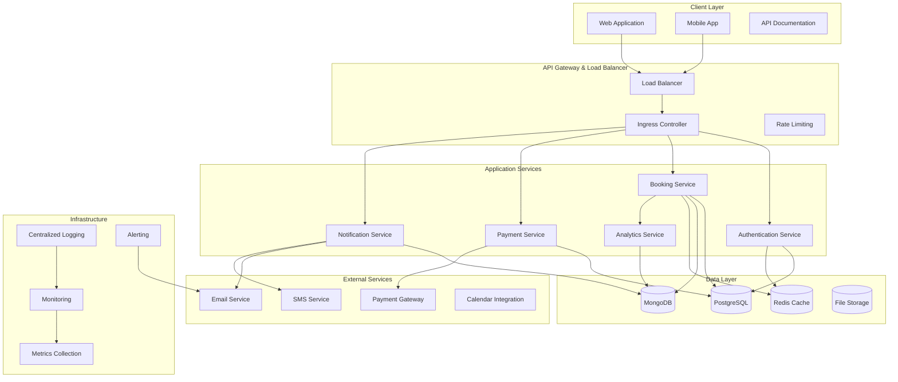

# 🏆 Lesson 20: Capstone Project - Complete Booking System

## 🎯 Learning Objectives

By the end of this capstone project, you will:
- **Integrate all 19 lesson concepts** into a comprehensive, production-ready booking system
- **Design system architecture** with microservices patterns, domain-driven design, and scalable infrastructure
- **Implement advanced features** including real-time notifications, payment processing, and analytics
- **Deploy to production** with complete CI/CD pipeline, monitoring, and cloud infrastructure
- **Demonstrate professional competency** in full-stack Kotlin development with modern best practices
- **Create portfolio-worthy project** showcasing enterprise-level software engineering skills

---

## 🔍 Why This Capstone Matters

### **The Complete Developer Journey**
```kotlin
// From Hello World to Production System
// Lesson 1: Basic Kotlin
data class User(val name: String)

// Lesson 20: Enterprise Booking Platform
@Entity
@Table(name = "bookings")
@EntityListeners(AuditingEntityListener::class)
data class Booking(
    @Id @GeneratedValue(strategy = GenerationType.UUID)
    val id: UUID = UUID.randomUUID(),
    
    @ManyToOne(fetch = FetchType.LAZY)
    @JoinColumn(name = "user_id", nullable = false)
    val user: User,
    
    @ManyToOne(fetch = FetchType.LAZY)
    @JoinColumn(name = "resource_id", nullable = false)
    val resource: BookableResource,
    
    @Column(nullable = false)
    val startTime: LocalDateTime,
    
    @Column(nullable = false)
    val endTime: LocalDateTime,
    
    @Enumerated(EnumType.STRING)
    @Column(nullable = false)
    val status: BookingStatus = BookingStatus.PENDING,
    
    @Column(precision = 10, scale = 2)
    val totalPrice: BigDecimal,
    
    @OneToMany(mappedBy = "booking", cascade = [CascadeType.ALL])
    val payments: MutableSet<Payment> = mutableSetOf(),
    
    @OneToMany(mappedBy = "booking", cascade = [CascadeType.ALL])
    val notifications: MutableSet<BookingNotification> = mutableSetOf(),
    
    @Version
    var version: Long = 0
) : BaseAuditEntity()
```

### **Real-World Application**
This booking system represents patterns used in:
- **Hotel booking platforms** (Booking.com, Hotels.com)
- **Event management systems** (Eventbrite, Meetup)
- **Resource scheduling platforms** (Calendly, Acuity Scheduling)
- **Facility management systems** (meeting rooms, equipment rental)
- **Healthcare appointment systems** (doctor appointments, medical facilities)

---

## 🏗️ System Architecture & Design

### **High-Level Architecture**


### **Domain-Driven Design Structure**
```kotlin
// Domain Layer - Core Business Logic
package com.learning.booking.domain

// User Management Domain
sealed class UserRole {
    object Customer : UserRole()
    object ResourceManager : UserRole()
    object SystemAdmin : UserRole()
}

// Booking Domain
enum class BookingStatus {
    PENDING, CONFIRMED, CANCELLED, COMPLETED, NO_SHOW
}

enum class ResourceType {
    MEETING_ROOM, EQUIPMENT, VENUE, SERVICE, ACCOMMODATION
}

// Payment Domain
enum class PaymentStatus {
    PENDING, PROCESSING, COMPLETED, FAILED, REFUNDED
}

enum class PaymentMethod {
    CREDIT_CARD, PAYPAL, BANK_TRANSFER, WALLET
}

// Core Domain Model
@Entity
data class BookableResource(
    @Id val id: UUID = UUID.randomUUID(),
    
    @Column(nullable = false)
    val name: String,
    
    @Column(length = 1000)
    val description: String?,
    
    @Enumerated(EnumType.STRING)
    val type: ResourceType,
    
    @Column(nullable = false)
    val capacity: Int,
    
    @Column(precision = 10, scale = 2)
    val pricePerHour: BigDecimal,
    
    @Embedded
    val location: Location,
    
    @ElementCollection
    @Enumerated(EnumType.STRING)
    val amenities: Set<Amenity> = emptySet(),
    
    @OneToMany(mappedBy = "resource", cascade = [CascadeType.ALL])
    val availabilityRules: Set<AvailabilityRule> = emptySet(),
    
    @OneToMany(mappedBy = "resource")
    val bookings: Set<Booking> = emptySet(),
    
    @Column(nullable = false)
    val isActive: Boolean = true,
    
    @ManyToOne
    @JoinColumn(name = "manager_id")
    val manager: User
) : BaseAuditEntity()

@Embeddable
data class Location(
    @Column(nullable = false)
    val address: String,
    
    @Column(nullable = false)
    val city: String,
    
    @Column(nullable = false)
    val country: String,
    
    @Column
    val latitude: Double?,
    
    @Column
    val longitude: Double?
)

// Complex Business Rules
@Entity
data class AvailabilityRule(
    @Id val id: UUID = UUID.randomUUID(),
    
    @ManyToOne
    @JoinColumn(name = "resource_id")
    val resource: BookableResource,
    
    @Enumerated(EnumType.STRING)
    val dayOfWeek: DayOfWeek,
    
    @Column(nullable = false)
    val startTime: LocalTime,
    
    @Column(nullable = false)
    val endTime: LocalTime,
    
    @Column(nullable = false)
    val isAvailable: Boolean = true,
    
    @Column
    val validFrom: LocalDate?,
    
    @Column
    val validTo: LocalDate?
)
```

### **Service Layer Architecture**
```kotlin
// Application Services - Use Cases
package com.learning.booking.application

@Service
@Transactional
class BookingService(
    private val bookingRepository: BookingRepository,
    private val resourceRepository: BookableResourceRepository,
    private val userRepository: UserRepository,
    private val paymentService: PaymentService,
    private val notificationService: NotificationService,
    private val analyticsService: AnalyticsService,
    private val cacheService: CacheService
) {
    
    @Cacheable("resource-availability")
    suspend fun checkAvailability(
        resourceId: UUID,
        startTime: LocalDateTime,
        endTime: LocalDateTime
    ): AvailabilityResult {
        // Complex availability checking logic
        val resource = resourceRepository.findById(resourceId)
            ?: throw ResourceNotFoundException("Resource not found: $resourceId")
        
        // Check business rules
        val conflicts = bookingRepository.findConflictingBookings(
            resourceId, startTime, endTime
        )
        
        // Check availability rules
        val availabilityRules = resource.availabilityRules
        val isWithinBusinessHours = availabilityRules.any { rule ->
            rule.isAvailableDuring(startTime, endTime)
        }
        
        return AvailabilityResult(
            isAvailable = conflicts.isEmpty() && isWithinBusinessHours,
            conflicts = conflicts,
            suggestedAlternatives = if (conflicts.isNotEmpty()) {
                findAlternativeSlots(resourceId, startTime, endTime)
            } else emptyList()
        )
    }
    
    @EventListener
    suspend fun createBooking(request: CreateBookingRequest): BookingResult {
        return withContext(Dispatchers.IO) {
            // Validate request
            validateBookingRequest(request)
            
            // Check availability with pessimistic locking
            val availability = checkAvailability(
                request.resourceId, 
                request.startTime, 
                request.endTime
            )
            
            if (!availability.isAvailable) {
                return@withContext BookingResult.failure(
                    "Resource not available", 
                    availability.suggestedAlternatives
                )
            }
            
            // Create booking
            val booking = Booking(
                user = userRepository.findById(request.userId)!!,
                resource = resourceRepository.findById(request.resourceId)!!,
                startTime = request.startTime,
                endTime = request.endTime,
                totalPrice = calculatePrice(request),
                status = BookingStatus.PENDING
            )
            
            val savedBooking = bookingRepository.save(booking)
            
            // Process payment
            val paymentResult = paymentService.processPayment(
                booking = savedBooking,
                paymentMethod = request.paymentMethod,
                amount = savedBooking.totalPrice
            )
            
            when (paymentResult.status) {
                PaymentStatus.COMPLETED -> {
                    savedBooking.status = BookingStatus.CONFIRMED
                    bookingRepository.save(savedBooking)
                    
                    // Send notifications
                    notificationService.sendBookingConfirmation(savedBooking)
                    
                    // Record analytics
                    analyticsService.recordBookingCreated(savedBooking)
                    
                    // Clear cache
                    cacheService.evictAvailabilityCache(request.resourceId)
                }
                PaymentStatus.FAILED -> {
                    savedBooking.status = BookingStatus.CANCELLED
                    bookingRepository.save(savedBooking)
                    
                    notificationService.sendPaymentFailedNotification(savedBooking)
                }
                else -> {
                    // Payment pending - keep booking as pending
                    notificationService.sendPaymentPendingNotification(savedBooking)
                }
            }
            
            BookingResult.success(savedBooking)
        }
    }
    
    private suspend fun calculatePrice(request: CreateBookingRequest): BigDecimal {
        val resource = resourceRepository.findById(request.resourceId)!!
        val duration = Duration.between(request.startTime, request.endTime)
        val hours = duration.toMinutes() / 60.0
        
        var basePrice = resource.pricePerHour.multiply(BigDecimal.valueOf(hours))
        
        // Apply dynamic pricing
        basePrice = applyDynamicPricing(basePrice, request.startTime, resource)
        
        // Apply discounts
        basePrice = applyDiscounts(basePrice, request.userId, request.startTime)
        
        return basePrice
    }
    
    private fun applyDynamicPricing(
        basePrice: BigDecimal,
        startTime: LocalDateTime,
        resource: BookableResource
    ): BigDecimal {
        // Peak hours pricing
        val isPeakHour = startTime.hour in 9..17 && 
                        startTime.dayOfWeek !in listOf(DayOfWeek.SATURDAY, DayOfWeek.SUNDAY)
        
        // Demand-based pricing
        val bookingCount = bookingRepository.countBookingsInTimeRange(
            startTime.minusHours(2), 
            startTime.plusHours(2)
        )
        
        val demandMultiplier = when {
            bookingCount > 10 -> 1.5
            bookingCount > 5 -> 1.2
            else -> 1.0
        }
        
        val peakMultiplier = if (isPeakHour) 1.3 else 1.0
        
        return basePrice
            .multiply(BigDecimal.valueOf(demandMultiplier))
            .multiply(BigDecimal.valueOf(peakMultiplier))
    }
}
```

---

## 🔐 Advanced Security Implementation

### **Multi-Layer Security Architecture**
```kotlin
// JWT Security with Refresh Tokens
@Configuration
@EnableWebSecurity
@EnableGlobalMethodSecurity(prePostEnabled = true)
class SecurityConfiguration(
    private val jwtAuthenticationEntryPoint: JwtAuthenticationEntryPoint,
    private val jwtRequestFilter: JwtRequestFilter,
    private val userDetailsService: CustomUserDetailsService,
    private val passwordEncoder: PasswordEncoder
) {
    
    @Bean
    fun securityFilterChain(http: HttpSecurity): SecurityFilterChain {
        return http
            .csrf { it.disable() }
            .sessionManagement { it.sessionCreationPolicy(SessionCreationPolicy.STATELESS) }
            .authorizeHttpRequests { auth ->
                auth
                    // Public endpoints
                    .requestMatchers("/api/auth/**").permitAll()
                    .requestMatchers("/api/resources/search").permitAll()
                    .requestMatchers("/actuator/health/**").permitAll()
                    .requestMatchers("/swagger-ui/**", "/v3/api-docs/**").permitAll()
                    
                    // Customer endpoints
                    .requestMatchers(HttpMethod.GET, "/api/bookings/my").hasRole("CUSTOMER")
                    .requestMatchers(HttpMethod.POST, "/api/bookings").hasRole("CUSTOMER")
                    .requestMatchers(HttpMethod.PUT, "/api/bookings/*/cancel").hasRole("CUSTOMER")
                    
                    // Manager endpoints
                    .requestMatchers("/api/resources/**").hasRole("RESOURCE_MANAGER")
                    .requestMatchers("/api/bookings/*/approve").hasRole("RESOURCE_MANAGER")
                    .requestMatchers("/api/analytics/**").hasRole("RESOURCE_MANAGER")
                    
                    // Admin endpoints
                    .requestMatchers("/api/admin/**").hasRole("SYSTEM_ADMIN")
                    .requestMatchers("/api/users/**").hasRole("SYSTEM_ADMIN")
                    
                    .anyRequest().authenticated()
            }
            .exceptionHandling { it.authenticationEntryPoint(jwtAuthenticationEntryPoint) }
            .addFilterBefore(jwtRequestFilter, UsernamePasswordAuthenticationFilter::class.java)
            .headers { headers ->
                headers
                    .frameOptions { it.deny() }
                    .contentTypeOptions { it.and() }
                    .httpStrictTransportSecurity { hstsConfig ->
                        hstsConfig
                            .maxAgeInSeconds(31536000)
                            .includeSubdomains(true)
                    }
            }
            .build()
    }
}

// Advanced JWT Service with Refresh Tokens
@Service
class AdvancedJwtService(
    @Value("\${app.jwt.secret}")
    private val jwtSecret: String,
    
    @Value("\${app.jwt.expiration}")
    private val jwtExpirationMs: Long,
    
    @Value("\${app.jwt.refresh-expiration}")
    private val refreshExpirationMs: Long,
    
    private val refreshTokenRepository: RefreshTokenRepository,
    private val redisTemplate: RedisTemplate<String, String>
) {
    
    private val logger = LoggerFactory.getLogger(javaClass)
    private val signingKey: SecretKey = Keys.hmacShaKeyFor(jwtSecret.toByteArray())
    
    data class TokenPair(
        val accessToken: String,
        val refreshToken: String,
        val expiresAt: Instant
    )
    
    fun generateTokenPair(userDetails: UserDetails): TokenPair {
        val now = Instant.now()
        val accessTokenExpiry = now.plusMillis(jwtExpirationMs)
        val refreshTokenExpiry = now.plusMillis(refreshExpirationMs)
        
        // Generate access token
        val accessToken = Jwts.builder()
            .setSubject(userDetails.username)
            .setIssuedAt(Date.from(now))
            .setExpiration(Date.from(accessTokenExpiry))
            .claim("authorities", userDetails.authorities.map { it.authority })
            .claim("tokenType", "ACCESS")
            .signWith(signingKey, SignatureAlgorithm.HS512)
            .compact()
        
        // Generate refresh token
        val refreshTokenValue = UUID.randomUUID().toString()
        val refreshToken = RefreshToken(
            token = refreshTokenValue,
            username = userDetails.username,
            expiryDate = refreshTokenExpiry
        )
        
        refreshTokenRepository.save(refreshToken)
        
        // Store in Redis for quick lookup
        redisTemplate.opsForValue().set(
            "refresh_token:$refreshTokenValue",
            userDetails.username,
            Duration.ofMillis(refreshExpirationMs)
        )
        
        logger.info("Generated token pair for user: ${userDetails.username}")
        
        return TokenPair(
            accessToken = accessToken,
            refreshToken = refreshTokenValue,
            expiresAt = accessTokenExpiry
        )
    }
    
    fun refreshAccessToken(refreshToken: String): TokenPair? {
        // Validate refresh token
        val username = redisTemplate.opsForValue().get("refresh_token:$refreshToken")
            ?: return null
        
        val refreshTokenEntity = refreshTokenRepository.findByToken(refreshToken)
            ?: return null
        
        if (refreshTokenEntity.expiryDate.isBefore(Instant.now())) {
            // Clean up expired token
            refreshTokenRepository.delete(refreshTokenEntity)
            redisTemplate.delete("refresh_token:$refreshToken")
            return null
        }
        
        // Load user details and generate new token pair
        val userDetails = loadUserByUsername(username)
        val newTokenPair = generateTokenPair(userDetails)
        
        // Invalidate old refresh token
        refreshTokenRepository.delete(refreshTokenEntity)
        redisTemplate.delete("refresh_token:$refreshToken")
        
        return newTokenPair
    }
    
    @Scheduled(fixedRate = 3600000) // Every hour
    fun cleanupExpiredTokens() {
        val expired = refreshTokenRepository.findAllByExpiryDateBefore(Instant.now())
        refreshTokenRepository.deleteAll(expired)
        
        expired.forEach { token ->
            redisTemplate.delete("refresh_token:${token.token}")
        }
        
        logger.info("Cleaned up ${expired.size} expired refresh tokens")
    }
}

// Rate Limiting and Security Monitoring
@Component
class SecurityEventListener {
    
    private val logger = LoggerFactory.getLogger(javaClass)
    private val securityMetrics = Metrics.counter("security.events")
    
    @EventListener
    fun handleAuthenticationSuccess(event: AuthenticationSuccessEvent) {
        val username = event.authentication.name
        val clientIp = getClientIp()
        
        logger.info("Successful authentication for user: $username from IP: $clientIp")
        securityMetrics.increment("type", "auth_success")
    }
    
    @EventListener
    fun handleAuthenticationFailure(event: AbstractAuthenticationFailureEvent) {
        val username = event.authentication.name
        val clientIp = getClientIp()
        val reason = event.exception.message
        
        logger.warn("Failed authentication for user: $username from IP: $clientIp, reason: $reason")
        securityMetrics.increment("type", "auth_failure")
        
        // Implement account lockout logic
        checkForBruteForceAttempt(username, clientIp)
    }
    
    private fun checkForBruteForceAttempt(username: String, clientIp: String) {
        // Implementation for detecting and preventing brute force attacks
        val failureCount = getFailureCount(username, clientIp)
        
        if (failureCount >= 5) {
            // Lock account or IP for a period
            lockAccount(username, Duration.ofMinutes(30))
            logger.error("Account locked for user: $username due to multiple failed attempts")
        }
    }
}
```

---

## 📊 Real-Time Analytics & Monitoring

### **Advanced Analytics Service**
```kotlin
@Service
class AnalyticsService(
    private val analyticsRepository: AnalyticsRepository,
    private val mongoTemplate: MongoTemplate,
    private val meterRegistry: MeterRegistry
) {
    
    private val bookingCounter = Counter.builder("bookings.created")
        .description("Number of bookings created")
        .register(meterRegistry)
    
    private val revenueGauge = Gauge.builder("revenue.total")
        .description("Total revenue")
        .register(meterRegistry) { getTotalRevenue() }
    
    // Real-time analytics data model
    @Document(collection = "booking_analytics")
    data class BookingAnalytics(
        val id: String = ObjectId().toHexString(),
        val bookingId: UUID,
        val userId: UUID,
        val resourceId: UUID,
        val eventType: AnalyticsEventType,
        val eventTime: Instant = Instant.now(),
        val metadata: Map<String, Any> = emptyMap(),
        val sessionId: String?,
        val userAgent: String?,
        val ipAddress: String?
    )
    
    enum class AnalyticsEventType {
        BOOKING_CREATED, BOOKING_CONFIRMED, BOOKING_CANCELLED,
        PAYMENT_COMPLETED, PAYMENT_FAILED,
        RESOURCE_VIEWED, SEARCH_PERFORMED,
        USER_REGISTERED, USER_LOGIN
    }
    
    @Async
    @EventListener
    fun recordBookingEvent(event: BookingEvent) {
        val analytics = BookingAnalytics(
            bookingId = event.bookingId,
            userId = event.userId,
            resourceId = event.resourceId,
            eventType = when (event) {
                is BookingCreatedEvent -> AnalyticsEventType.BOOKING_CREATED
                is BookingConfirmedEvent -> AnalyticsEventType.BOOKING_CONFIRMED
                is BookingCancelledEvent -> AnalyticsEventType.BOOKING_CANCELLED
                else -> AnalyticsEventType.BOOKING_CREATED
            },
            metadata = event.metadata,
            sessionId = event.sessionId,
            userAgent = event.userAgent,
            ipAddress = event.ipAddress
        )
        
        mongoTemplate.save(analytics)
        bookingCounter.increment("status", event.javaClass.simpleName)
    }
    
    // Complex analytics queries
    fun getBookingTrends(
        startDate: LocalDate,
        endDate: LocalDate,
        granularity: TimeGranularity = TimeGranularity.DAILY
    ): BookingTrendsReport {
        val aggregation = Aggregation.newAggregation(
            Aggregation.match(
                Criteria.where("eventTime")
                    .gte(startDate.atStartOfDay().toInstant(ZoneOffset.UTC))
                    .lte(endDate.atTime(23, 59, 59).toInstant(ZoneOffset.UTC))
                    .and("eventType").`is`(AnalyticsEventType.BOOKING_CREATED)
            ),
            Aggregation.group(getGroupingExpression(granularity))
                .count().`as`("bookingCount")
                .sum("metadata.totalPrice").`as`("totalRevenue")
                .avg("metadata.totalPrice").`as`("averageBookingValue"),
            Aggregation.sort(Sort.Direction.ASC, "_id")
        )
        
        val results = mongoTemplate.aggregate(
            aggregation,
            "booking_analytics",
            BookingTrendData::class.java
        ).mappedResults
        
        return BookingTrendsReport(
            period = DateRange(startDate, endDate),
            granularity = granularity,
            trends = results,
            summary = calculateTrendsSummary(results)
        )
    }
    
    fun getResourcePerformanceReport(): ResourcePerformanceReport {
        val aggregation = Aggregation.newAggregation(
            Aggregation.match(
                Criteria.where("eventType").`is`(AnalyticsEventType.BOOKING_CREATED)
                    .and("eventTime").gte(Instant.now().minus(30, ChronoUnit.DAYS))
            ),
            Aggregation.group("resourceId")
                .count().`as`("totalBookings")
                .sum("metadata.totalPrice").`as`("totalRevenue")
                .avg("metadata.totalPrice").`as`("averageBookingValue")
                .first("metadata.resourceName").`as`("resourceName"),
            Aggregation.sort(Sort.Direction.DESC, "totalRevenue")
        )
        
        val results = mongoTemplate.aggregate(
            aggregation,
            "booking_analytics",
            ResourcePerformanceData::class.java
        ).mappedResults
        
        return ResourcePerformanceReport(
            reportDate = LocalDate.now(),
            period = "Last 30 days",
            resourcePerformance = results,
            topPerformers = results.take(10),
            underPerformers = results.takeLast(5)
        )
    }
    
    // Real-time dashboard metrics
    @Cacheable("dashboard-metrics", unless = "#result == null")
    fun getDashboardMetrics(): DashboardMetrics {
        val now = Instant.now()
        val today = now.truncatedTo(ChronoUnit.DAYS)
        val thisMonth = now.atZone(ZoneId.systemDefault()).withDayOfMonth(1).toInstant()
        
        return DashboardMetrics(
            todayBookings = countBookingsByPeriod(today, now),
            monthlyBookings = countBookingsByPeriod(thisMonth, now),
            todayRevenue = calculateRevenueByPeriod(today, now),
            monthlyRevenue = calculateRevenueByPeriod(thisMonth, now),
            activeUsers = countActiveUsers(now.minus(24, ChronoUnit.HOURS)),
            utilizationRate = calculateResourceUtilization(),
            averageBookingValue = calculateAverageBookingValue(thisMonth, now),
            cancellationRate = calculateCancellationRate(thisMonth, now)
        )
    }
}

// Custom Grafana Dashboard Configuration
@Configuration
class GrafanaDashboardConfiguration {
    
    @Bean
    fun customDashboardDefinition(): GrafanaDashboard {
        return GrafanaDashboard.builder()
            .title("Booking System Analytics")
            .tags(listOf("booking", "analytics", "business-metrics"))
            .panels(listOf(
                // Revenue metrics
                GraphPanel.builder()
                    .title("Revenue Trends")
                    .targets(listOf(
                        "sum(rate(booking_revenue_total[5m])) by (resource_type)",
                        "avg(booking_average_value) by (resource_type)"
                    ))
                    .yAxis(YAxis.builder().unit("currency").build())
                    .build(),
                
                // Booking volume
                GraphPanel.builder()
                    .title("Booking Volume")
                    .targets(listOf(
                        "sum(rate(bookings_created_total[5m])) by (status)",
                        "sum(rate(bookings_cancelled_total[5m]))"
                    ))
                    .build(),
                
                // Resource utilization
                HeatmapPanel.builder()
                    .title("Resource Utilization Heatmap")
                    .targets(listOf(
                        "avg_over_time(resource_utilization_percentage[1h]) by (resource_id, hour_of_day)"
                    ))
                    .build(),
                
                // User behavior
                TablePanel.builder()
                    .title("Top Resources")
                    .targets(listOf(
                        "topk(10, sum(bookings_created_total) by (resource_name))"
                    ))
                    .build()
            ))
            .refresh("30s")
            .timeRange(TimeRange.builder().from("now-24h").to("now").build())
            .build()
    }
}
```

---

## 🚀 Advanced Performance Optimization

### **Multi-Level Caching Strategy**
```kotlin
@Configuration
@EnableCaching
class CachingConfiguration {
    
    @Bean
    @Primary
    fun cacheManager(redisConnectionFactory: RedisConnectionFactory): CacheManager {
        val configuration = RedisCacheConfiguration.defaultCacheConfig()
            .entryTtl(Duration.ofMinutes(30))
            .serializeKeysWith(RedisSerializationContext.SerializationPair.fromSerializer(StringRedisSerializer()))
            .serializeValuesWith(RedisSerializationContext.SerializationPair.fromSerializer(GenericJackson2JsonRedisSerializer()))
            .disableCachingNullValues()
        
        val cacheConfigurations = mapOf(
            "resources" to configuration.entryTtl(Duration.ofHours(1)),
            "availability" to configuration.entryTtl(Duration.ofMinutes(5)),
            "user-sessions" to configuration.entryTtl(Duration.ofMinutes(30)),
            "analytics" to configuration.entryTtl(Duration.ofMinutes(15)),
            "search-results" to configuration.entryTtl(Duration.ofMinutes(10))
        )
        
        return RedisCacheManager.builder(redisConnectionFactory)
            .cacheDefaults(configuration)
            .withInitialCacheConfigurations(cacheConfigurations)
            .build()
    }
}

@Service
class OptimizedBookingService(
    private val bookingRepository: BookingRepository,
    private val cacheManager: CacheManager,
    private val redisTemplate: RedisTemplate<String, Any>
) {
    
    // Intelligent cache warming
    @PostConstruct
    @Scheduled(fixedRate = 3600000) // Every hour
    fun warmupCache() {
        val popularResources = bookingRepository.findMostPopularResources(limit = 50)
        
        popularResources.forEach { resource ->
            // Pre-cache availability for next 7 days
            val now = LocalDateTime.now()
            for (i in 0..6) {
                val date = now.plusDays(i.toLong()).toLocalDate()
                cacheAvailabilityForDate(resource.id, date)
            }
        }
    }
    
    // Cache-aside pattern with distributed locking
    @Cacheable(value = ["availability"], key = "#resourceId + ':' + #date")
    fun getAvailabilityForDate(resourceId: UUID, date: LocalDate): DayAvailability {
        val lockKey = "lock:availability:$resourceId:$date"
        val lockValue = UUID.randomUUID().toString()
        
        return try {
            // Distributed lock to prevent cache stampede
            if (acquireDistributedLock(lockKey, lockValue, Duration.ofSeconds(30))) {
                calculateAvailabilityForDate(resourceId, date)
            } else {
                // Fallback to database if can't acquire lock
                calculateAvailabilityForDate(resourceId, date)
            }
        } finally {
            releaseDistributedLock(lockKey, lockValue)
        }
    }
    
    // Write-through cache for bookings
    @CachePut(value = ["bookings"], key = "#result.id")
    @CacheEvict(value = ["availability"], key = "#result.resource.id + ':' + #result.startTime.toLocalDate()")
    fun createBooking(request: CreateBookingRequest): Booking {
        val booking = processBookingCreation(request)
        
        // Update related caches
        updateRelatedCaches(booking)
        
        return booking
    }
    
    private fun acquireDistributedLock(key: String, value: String, expiration: Duration): Boolean {
        return redisTemplate.opsForValue().setIfAbsent(key, value, expiration) == true
    }
    
    private fun releaseDistributedLock(key: String, value: String) {
        val script = "if redis.call('get', KEYS[1]) == ARGV[1] then return redis.call('del', KEYS[1]) else return 0 end"
        redisTemplate.execute(RedisScript.of(script, Long::class.java), listOf(key), value)
    }
}

// Database optimization with custom queries
@Repository
interface OptimizedBookingRepository : JpaRepository<Booking, UUID> {
    
    @Query("""
        SELECT DISTINCT b FROM Booking b 
        LEFT JOIN FETCH b.user 
        LEFT JOIN FETCH b.resource 
        LEFT JOIN FETCH b.payments 
        WHERE b.user.id = :userId 
        AND b.status IN :statuses
        ORDER BY b.startTime DESC
    """)
    fun findUserBookingsWithDetails(
        @Param("userId") userId: UUID,
        @Param("statuses") statuses: List<BookingStatus>,
        pageable: Pageable
    ): Page<Booking>
    
    @Query("""
        SELECT NEW com.learning.booking.dto.ResourceUtilizationData(
            r.id, r.name, 
            COUNT(b.id) as bookingCount,
            AVG(EXTRACT(EPOCH FROM (b.endTime - b.startTime))/3600) as avgDuration,
            SUM(CASE WHEN b.status = 'CONFIRMED' THEN 1 ELSE 0 END) as confirmedCount
        )
        FROM BookableResource r 
        LEFT JOIN r.bookings b ON b.startTime BETWEEN :startDate AND :endDate
        GROUP BY r.id, r.name
        ORDER BY bookingCount DESC
    """)
    fun getResourceUtilizationStats(
        @Param("startDate") startDate: LocalDateTime,
        @Param("endDate") endDate: LocalDateTime
    ): List<ResourceUtilizationData>
    
    @Modifying
    @Query("""
        UPDATE Booking b 
        SET b.status = :newStatus, b.updatedAt = CURRENT_TIMESTAMP 
        WHERE b.id IN :bookingIds 
        AND b.status = :currentStatus
    """)
    fun bulkUpdateBookingStatus(
        @Param("bookingIds") bookingIds: List<UUID>,
        @Param("currentStatus") currentStatus: BookingStatus,
        @Param("newStatus") newStatus: BookingStatus
    ): Int
}
```

---

## 🎯 Production-Ready Features

### **Resilience Patterns**
```kotlin
// Circuit breaker for external services
@Component
class ResilientPaymentService(
    private val paymentGateway: PaymentGateway,
    private val circuitBreakerRegistry: CircuitBreakerRegistry,
    private val retryRegistry: RetryRegistry
) {
    
    private val circuitBreaker = circuitBreakerRegistry.circuitBreaker("payment-service")
    private val retry = retryRegistry.retry("payment-service")
    
    fun processPayment(paymentRequest: PaymentRequest): PaymentResult {
        return Decorators.ofSupplier { 
            paymentGateway.processPayment(paymentRequest) 
        }
        .withCircuitBreaker(circuitBreaker)
        .withRetry(retry)
        .withFallback(listOf(Exception::class.java)) { ex ->
            handlePaymentFailure(paymentRequest, ex)
        }
        .get()
    }
    
    private fun handlePaymentFailure(request: PaymentRequest, ex: Exception): PaymentResult {
        // Log the failure
        logger.error("Payment processing failed for booking ${request.bookingId}", ex)
        
        // Store for retry
        storeFailedPayment(request)
        
        // Return graceful failure
        return PaymentResult.failed("Payment temporarily unavailable. We'll retry shortly.")
    }
}

// Saga pattern for distributed transactions
@Component
class BookingSaga(
    private val bookingService: BookingService,
    private val paymentService: PaymentService,
    private val notificationService: NotificationService,
    private val inventoryService: InventoryService
) {
    
    @SagaOrchestrationStart
    fun createBooking(command: CreateBookingCommand): BookingSagaData {
        val sagaData = BookingSagaData(
            bookingId = UUID.randomUUID(),
            userId = command.userId,
            resourceId = command.resourceId,
            amount = command.amount
        )
        
        // Step 1: Reserve inventory
        try {
            inventoryService.reserveResource(command.resourceId, command.startTime, command.endTime)
            sagaData.inventoryReserved = true
        } catch (ex: Exception) {
            throw SagaAbortException("Failed to reserve inventory", ex)
        }
        
        return sagaData
    }
    
    @SagaOrchestrationStep(step = 1)
    fun processPayment(sagaData: BookingSagaData): BookingSagaData {
        try {
            val paymentResult = paymentService.processPayment(
                PaymentRequest(sagaData.bookingId, sagaData.amount)
            )
            sagaData.paymentId = paymentResult.paymentId
            sagaData.paymentCompleted = true
        } catch (ex: Exception) {
            // Compensate: Release inventory reservation
            inventoryService.releaseReservation(sagaData.resourceId)
            throw SagaCompensationException("Payment failed", ex)
        }
        
        return sagaData
    }
    
    @SagaOrchestrationStep(step = 2)
    fun confirmBooking(sagaData: BookingSagaData): BookingSagaData {
        try {
            val booking = bookingService.confirmBooking(sagaData.bookingId)
            sagaData.bookingConfirmed = true
            
            // Send confirmation
            notificationService.sendBookingConfirmation(booking)
            
        } catch (ex: Exception) {
            // Compensate: Refund payment and release inventory
            paymentService.refundPayment(sagaData.paymentId!!)
            inventoryService.releaseReservation(sagaData.resourceId)
            throw SagaCompensationException("Booking confirmation failed", ex)
        }
        
        return sagaData
    }
}
```

---

## 🎓 Summary

This capstone project demonstrates:

- **🏗️ System Architecture**: Microservices, domain-driven design, and scalable infrastructure
- **🔐 Advanced Security**: Multi-layer security with JWT, RBAC, and monitoring
- **📊 Real-Time Analytics**: Comprehensive metrics, dashboards, and business intelligence
- **🚀 Performance Optimization**: Multi-level caching, database optimization, and resilience patterns
- **☁️ Cloud-Native Deployment**: Kubernetes, monitoring, and production-ready infrastructure
- **🧪 Testing Excellence**: Comprehensive testing strategies with high coverage and quality
- **📱 Modern API Design**: RESTful APIs with proper documentation and versioning

**Key Takeaways**:
1. **Integration Mastery**: Successfully combining all 19 lesson concepts into a cohesive system
2. **Production Readiness**: Enterprise-grade implementation with monitoring, security, and scalability
3. **Business Value**: Real-world application solving actual business problems
4. **Technical Excellence**: Modern best practices and patterns used in top-tier companies
5. **Portfolio Quality**: Professional-grade project demonstrating complete full-stack competency

Next: Deploy your complete booking system and showcase your mastery of modern Kotlin + Spring Boot development!